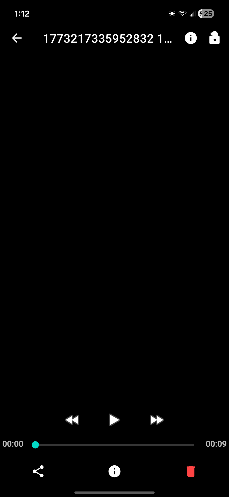
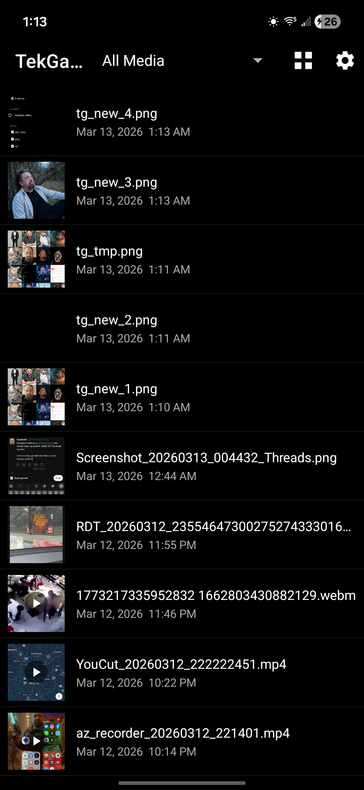
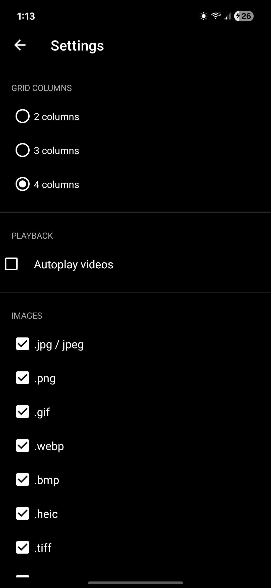

# TekGallery

A clean, fast Android gallery app for browsing photos and videos stored on your device.

## Screenshots

| Gallery Grid | Photo Viewer | Video Player |
|:---:|:---:|:---:|
|  |  |  |

| List View | Settings |
|:---:|:---:|
|  |  |

## Features

- Grid-based gallery view with smooth image loading
- Full-screen image/video viewer with swipe navigation
- Pinch-to-zoom on images via PhotoView
- Media caching for fast browsing
- Settings and About screens
- Supports Android 8.0+ (API 26+)

## Tech Stack

| Layer | Library |
|---|---|
| Language | Kotlin |
| Architecture | MVVM (ViewModel + LiveData) |
| Image loading | Glide 4.16 |
| Paging/swiping | ViewPager2 |
| Zoom | PhotoView 2.3 |
| Concurrency | Kotlin Coroutines |
| UI | Material 3, ConstraintLayout, RecyclerView |

## Permissions

- `READ_MEDIA_IMAGES` / `READ_MEDIA_VIDEO` (Android 13+)
- `READ_EXTERNAL_STORAGE` (Android 12 and below)

## Build

Requirements: Java 17, Android SDK

```bash
# Debug build
./gradlew assembleDebug

# Install on connected device
./gradlew installDebug

# Run unit tests
./gradlew test

# Lint check
./gradlew lint
```

## Project Structure

```
app/src/main/java/com/tekphreak/tekgallery/
├── SplashActivity.kt         # Launch screen
├── MainActivity.kt           # Gallery grid entry point
├── GalleryAdapter.kt         # RecyclerView adapter
├── GalleryViewModel.kt       # Media loading logic
├── GridSpacingDecoration.kt  # Grid item spacing
├── ImageDetailActivity.kt    # Full-screen viewer host
├── MediaDetailFragment.kt    # Per-item viewer fragment
├── MediaDetailPagerAdapter.kt
├── MediaItem.kt              # Data model
├── MediaCache.kt             # Thumbnail/media cache
├── SettingsActivity.kt
└── AboutActivity.kt
```

## Minimum Requirements

- Android 8.0 Oreo (API 26)
- Target: Android 14 (API 34)
